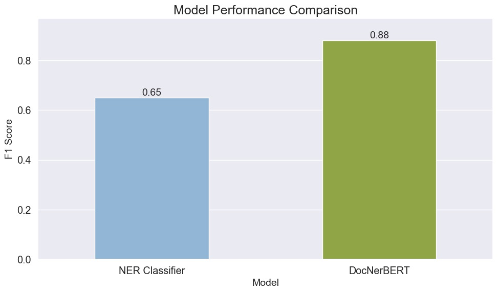
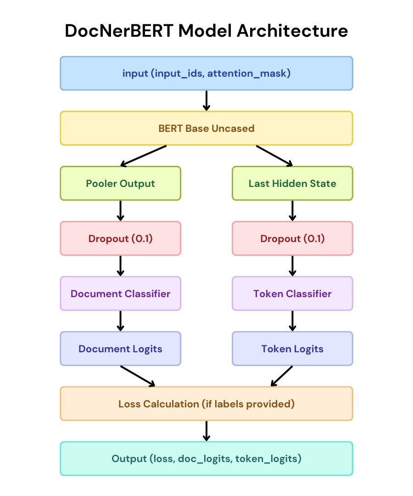
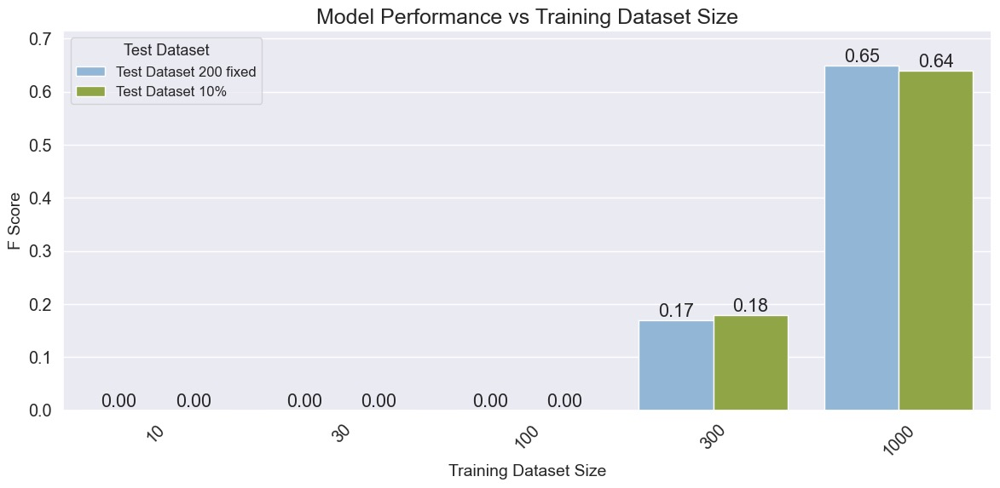
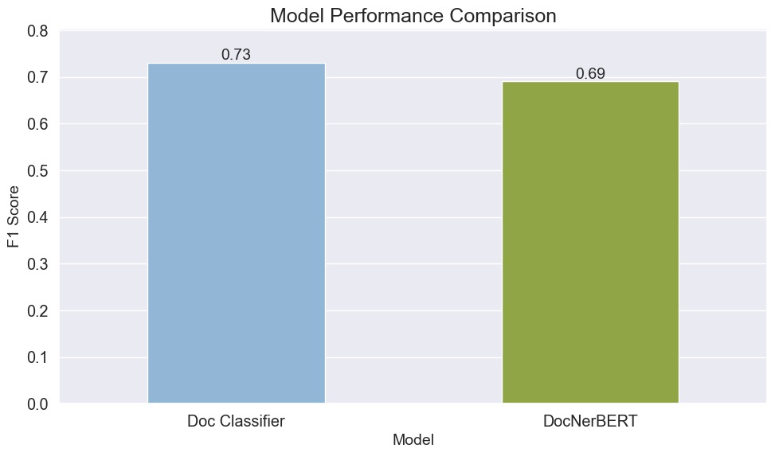

# Training BERT(s) on CONLL dataset

We will train various architectures and evaluate them on the same test set. The most curious result, I believe, is the result in Part 5.2.

<p align="center">
  
</p>

## 1- Train BERT on CONLL and compare different training sizes

In this part we will implement a BERT and train it on sizes of [10, 30, 100, 300, 1000]. Then the testing part will be done to measure the F1 scores, using two methods.

1. Fixed test dataset of size 200
2. Test set that has 10% and 20% of the size of the training set

The expectations was that before size 300, we may not see any precision (therefore not an F1 score), and it seems to be correct.

To summarize, we import the necessary libraries, prepare the datasets, making sure using the same seed throughout the project.

The model we use is,

```python
    model = AutoModelForTokenClassification.from_pretrained("bert-base-uncased", num_labels=len(train_labels))
```

## 2- Augment the CONLL dataset (of size 1000), with document-level labels, using GPT-3.5

In this part we simply prepare the prompt and the dataset as inputs and make an API call to GPT 3.5. We make sure to receive only one digit as a response for 5 classes. The prompt used:

```python
system_message = {
    "role": "system",
    "content": (
        "You are an expert in document classification. "
        "Classify the provided text into one of these categories by responding with only the category number: "
        "0 for World, 1 for Sport, 2 for Business, 3 for Technology, 4 for Other. "
        "Choose the most relevant category if the text fits into multiple categories. "
        "Do not provide any additional information or explanation in your response."
    )
}

```

The data in this part is succesfully augmented, a new column is added and from this point on, we have csv format data.

```bash
tokens,ner_tags,sentence_label
"['DETROIT', '5', '8', '0', '263', '289']","[3, 0, 0, 0, 0, 0]",4
```

## 3- Train a BERT document classifier, using the augmented data

We train a BERT this time for document calssification instead of NER. We read the csv files, preprocess them for document classification.

```python
# Preprocess the data
train_data = preprocess_data(train_data)
val_data = preprocess_data(val_data)
test_data = preprocess_data(test_data)

# Convert to Hugging Face datasets
train_dataset = Dataset.from_pandas(train_data)
val_dataset = Dataset.from_pandas(val_data)
test_dataset = Dataset.from_pandas(test_data)

# Initialize tokenizer and model
tokenizer = AutoTokenizer.from_pretrained("bert-base-uncased")
```

And we use the following model,

```python
model = AutoModelForSequenceClassification.from_pretrained("bert-base-uncased", num_labels=5)
```

After the training, the model is saved and test set is given for F1 score evaluation. The F1 score will be compared with the next parts results.

## 4- Train a custom BERT, that can predict both token level and document level in a single forward pass. (DocNerBERT)

In this part we prepare one BERT model, as simple as possible that will separate into two heads to feed forward at once, both token and document classification. I used torch nn.Module as the super class for this part.

```python
class DocNerBERT(nn.Module):
    def __init__(self, num_doc_labels, num_token_labels):
        super().__init__()

        self.bert = BertModel.from_pretrained('bert-base-uncased')
        self.dropout = nn.Dropout(0.1)

        self.doc_classifier = nn.Linear(self.bert.config.hidden_size, num_doc_labels)
        self.token_classifier = nn.Linear(self.bert.config.hidden_size, num_token_labels)

        self.loss = nn.CrossEntropyLoss()
```

So we have BERT and on top of it, we have two linear layers, each will have a dropout. Below is a diagram to represent the model,

<p align="center">
  
</p>

## 5- Compare the results using the F1 scores

In this part I will simply provide figures of the F1 score comparisons.

### 5.1- Compare NER results, with respect to training dataset sizes

<p align="center">
  
</p>

### 5.2- Compare NER resutls of size 1000, with the DocNerBERT's token classification results

<p align="center">
  
</p>

### 5.3- Compare Doc classifiers document level classification results with the DocNerBERT's document classification results

<p align="center">
  
</p>

### Notes

We have the directory structure:

- train-ner
  - train_eval.py: This file trains and evaluates on the test set
  - eval_fscore.py: This file reads the saved models and evaluates. I used it during development for testing.
- train-doc
  - data_augmentation.py: Calls GPT API to augment the data
  - train_document_classifier.py: Trains the augmented data and evaluates F1 score on the test set
- train-docner
  - train_DocNerBERT.py: Defines the custom model, trains it on the augmented dataset, evaluates F1 scores for the test set for both token and document level classification
- data/: This directory has the augmented datafiles saved
- imgs/: The images that is used in this readme file.

## License

MIT
